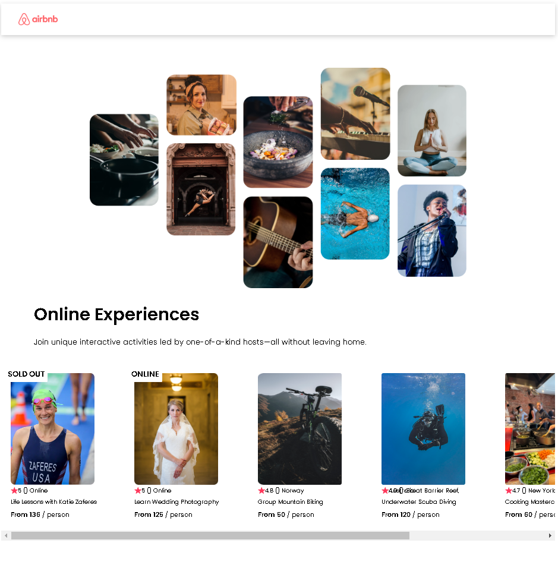

# AirBnbClone

## Description

Testing & Practicing React Skills, specifically prop drilling and data manipulation.

Duplicated AirBnb experiences page, focused in on iteration of card component.

## Table of Contents

- [Features](#features)
- [Contributors](#contributors)
- [Technologies](#technologies)
- [License](#license)
- [UI](#ui)
- [LiveSite](#livesite)

## Features

## Contributors

This application was developed by the following contributors:

- [Oscar Leal](https://github.com/Oscarl214)

## UI

## Technologies

This personal project was built using the following:

- Node.js
- React.js
- CSS

## License

    This app is licensed under the MIT license.

## LiveSite

Coming soon.
